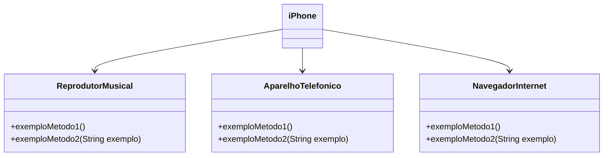
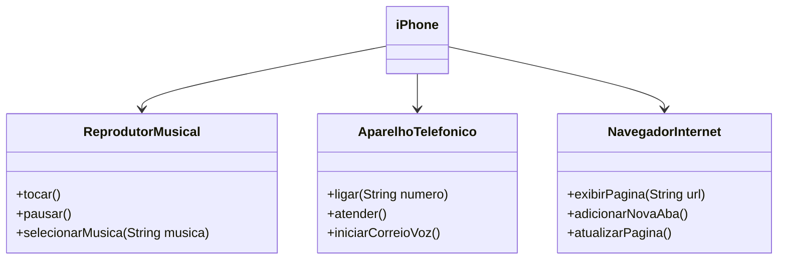

# Projeto: Modelagem Orientada a Objetos do Componente iPhone

Este repositório apresenta a resolução do desafio de Programação Orientada a Objetos (POO) proposto na [Trilha Java Básico da DIO](https://github.com/digitalinnovationone/trilha-java-basico/tree/main/), com foco na modelagem, diagramação UML e discussão do componente **iPhone**, abordando suas principais funcionalidades: reprodutor musical, aparelho telefônico e navegador de internet.

---

## Índice

* [Visão Geral do Projeto](#visão-geral-do-projeto)
* [Autores](#autores)
* [Contextualização do Desafio](#contextualização-do-desafio)
* [Diagrama UML](#diagrama-uml)
* [Modelagem do Diagrama UML](#modelagem-do-diagrama-uml)
* [Aprendizados](#aprendizados)
* [Próximo Passo](#próximo-passo)
* [Referências](#referências)
* [Contato](#contato)

---

## Visão Geral do Projeto

O projeto visa exercitar os conceitos fundamentais da Programação Orientada a Objetos por meio da modelagem UML de um componente iPhone. Os principais objetivos são:

* Elaborar um diagrama UML representando interfaces e classes essenciais.
* Promover abstrações alinhadas às boas práticas acadêmicas e documentação oficial.

---

## Autores

* [Gleyson Sampaio](https://github.com/glysns) - Instrutor da DIO.

---

## Contextualização do Desafio

Com base no vídeo oficial de lançamento do iPhone em 2007, foi proposto modelar o comportamento do dispositivo considerando três componentes principais:

* **Reprodutor Musical**: reproduzir, pausar e selecionar músicas.
* **Aparelho Telefônico**: ligar, atender e acessar o correio de voz.
* **Navegador de Internet**: exibir páginas, adicionar abas e atualizar.

**Referência:**
[Lançamento iPhone 2007 – Minutos relevantes: 00:15 até 00:55](https://www.youtube.com/watch?v=9ou608QQRq8)

---

### Objetivo
1. Criar um diagrama UML que represente as funcionalidades descritas acima.
2. Implementar as classes e interfaces correspondentes em Java (Opcional).

### Exemplo de Diagrama UML (Mermaid)

## Modelagem do Diagrama UML

A modelagem foi realizada conforme o diagrama UML abaixo, conforme o enunciado, utilizando a sintaxe [Mermaid](https://mermaid.js.org/):

---

## Aprendizados

Durante o desenvolvimento deste projeto, foi possível aprimorar meus conhecimentos em:

* Abstração e encapsulamento em Programação Orientada a Objetos;
* Implementação de interfaces e diagramação UML;
* Utilização da plataforma [Mermaid](https://mermaid.js.org/)

---

## Próximo Passo

* [ ] Implementar as classes Java representadas no diagrama UML.

---

## Referências

* [Documentação Oficial Java](https://docs.oracle.com/en/java/)
* [DIO - Digital Innovation One](https://www.dio.me/)
* [GitHub DIO - Digital Innovation One](https://github.com/digitalinnovationone/trilha-java-basico/tree/main/desafios/poo/)
* [Vídeo Oficial Apple: Lançamento iPhone 2007](https://www.youtube.com/watch?v=9ou608QQRq8)

---

## Contato

**Email:** rafaellopes.dev@email.com  
**LinkedIn:** [LinkedIn](https://www.linkedin.com/in/rafael-lopes-desenvolvedor-fullstack/)  
**Site:** [rafaellopes.dev](https://rafaellopes.dev)

---
